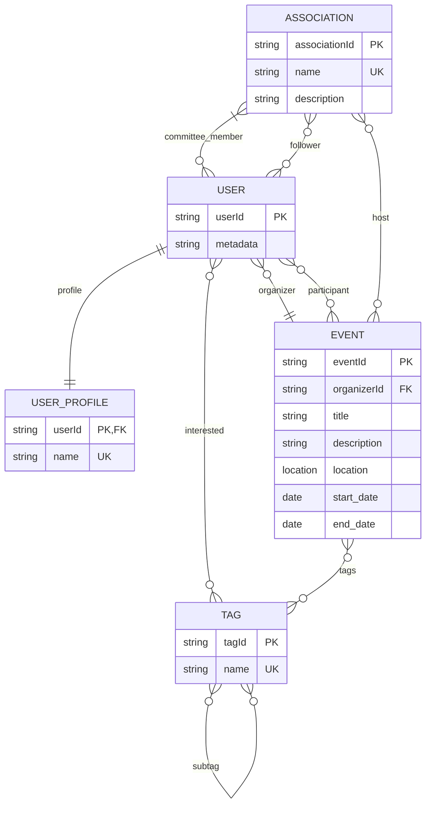

# Database structure
## Description
This is the structure of the database.
This structure only contains the basic elements needed for the main functions of the app.
It is expected to evolve in the development of the app.
- USER: a user of the app, metadata reference the attributes defined by https://supabase.com/docs/guides/auth/auth-user-management
- USER_PROFILE: information related to a user
- EVENT: an event created in the app, created by a user; the user has the choice to create the event for an association (host relation) or for himself
- TAG: a tag that can be linked to the user's preferences and the event's tags list
- ASSOCIATION: an association that has some committee members and followers, the committee members can create events for the association

## Diagram

For mermaid syntax, see: https://mermaid.js.org/syntax/entityRelationshipDiagram.html
